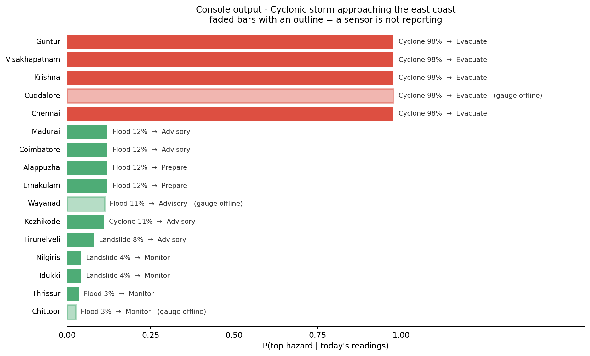
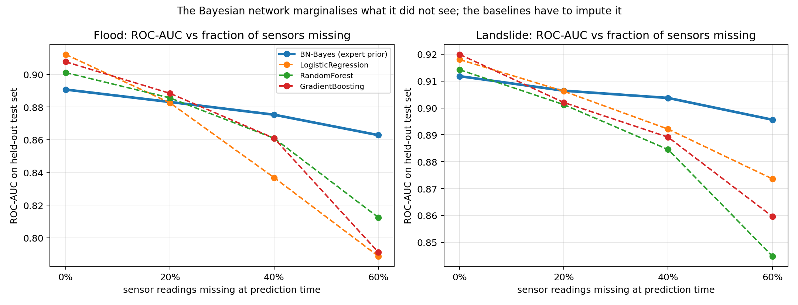
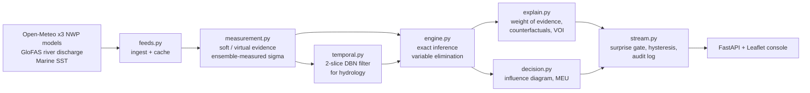

# Multi-Hazard Disaster Risk — Explainable Bayesian Network


A discrete Bayesian network (18 nodes, exact inference) that turns one district's
live weather and river readings into flood / landslide / cyclone / heatwave
probabilities, a plain-language explanation, a confidence statement, and a
recommended action chosen by maximum expected utility. It runs on live public
feeds (Open-Meteo, GloFAS) with no API key, and keeps working when sensors drop out.

> **Course project** — 22AIE301 Probabilistic Reasoning, Amrita Vishwa Vidyapeetham, Coimbatore.
> Team of four: Sai Reddy A., Rohit Vardhan M., Jithin Reddy K., Sai Vandith.



## Why a Bayesian network and not a classifier

District sensor networks lose readings all the time. A classifier has to impute
what it didn't see; a BN marginalises it out. On held-out data, gradient boosting
and logistic regression beat the BN by ~0.03 AUC when every sensor reports — and
lose to it once roughly a quarter of readings are missing:



## Architecture



## Tech stack

Python · pgmpy · NumPy / pandas · scikit-learn (baselines) · FastAPI · Leaflet / Folium · pytest

## Real-time layer (added after the first review)

The reviewer's feedback was: *"It is mentioned real-time sensor data, but you are choosing the
existing preprocessed data? Also, what methods are you incorporating to process the
real-time data feed?"* Both halves were fair. See
[docs/realtime_pipeline.md](docs/realtime_pipeline.md) for the full answer; in short:

* the feed is now genuinely live, from three public services;
* the **weather layer of the model is re-estimated from 35,072 real district-days**
  (16 districts, 2019–2024) instead of from our simulator;
* readings enter as **soft (virtual) evidence** whose width is measured from the
  disagreement between the three forcast models, not chosen by us;
* the hydrology is tracked with a **recursive Bayesian filter** (a two-slice DBN), so
  rainfall accumulates across days — this also removes the "model is static"
  limitation we listed last time;
* a **Bayesian surprise gate**, asymmetric alert hysteresis, mutual-information-driven
  polling, and an append-only audit log.

The single most useful thing that came out of it: our simulator believed **43% of
monsoon days were "heavy" rainfall; across 35,072 real district-days it is 1.1%** — a
36× overestimate sitting inside the model we presented at the zeroth review.

## Quick start

```bash
pip install -r requirements.txt
```

```bash
python -m src.simulate && python -m src.learn && python -m src.evaluate && python -m src.viz
```

Fetch six years of real observations and relearn the weather layer (needs internet,
a few minutes, cached afterwards):

```bash
python -m src.observed
```

Run one real-time pass over all 16 districts against the live APIs:

```bash
python -m src.stream
```

Start the console:

```bash
python -m uvicorn app.main:app --port 8100
```

Then open <http://127.0.0.1:8100> and use the **Live feeds** toggle in the header.

On Windows `run.bat` wraps all of it:

```bash
run.bat setup
```

```bash
run.bat all
```

```bash
run.bat observed
```

```bash
run.bat live
```

```bash
run.bat replay
```

```bash
run.bat app
```

```bash
run.bat test
```

## Repository layout

```
src/
  config.py      state spaces, IMD/CWC discretisation cut-offs, file paths
  networks.py    the DAG + expert CPTs (ordered logit, noisy-OR, interactions)
  simulate.py    the hazard-label generator (see the honesty note below)
  discretize.py  continuous readings -> discrete states, missing values allowed
  learn.py       MLE / BDeu / Dirichlet-with-expert-prior parameter learning,
                 plus a Hill-Climb structure cross-check
  engine.py      RiskEngine: the only module that imports pgmpy.inference
  explain.py     weight of evidence, MAP chain, counterfactuals, value of info
  decision.py    utilities, maximum expected utility, derived thresholds, EVPI
  evaluate.py    held-out comparison against sklearn baselines + the missing
                 sensor study + calibration
  viz.py         every figure used in the slide deck
  gis.py         standalone Folium map export
  scenarios.py   seeded demo scenarios for the console
  -- the real-time layer --
  feeds.py       live ingestion: Open-Meteo weather (3 NWP models), GloFAS river
                 discharge, marine SST; aggregation, bankfull calibration,
                 caching, snapshots, graceful failure
  observed.py    six years of real observations + re-estimation of the weather
                 layer -> artifacts/hybrid_cpts.json
  measurement.py soft/virtual evidence: Gaussian bin likelihood, ensemble-measured
                 sigma, staleness decay, Pearl's indicator construction
  temporal.py    recursive Bayesian filter over the hydrology (2-slice DBN),
                 transition calibration, virtual-evidence hand-back
  stream.py      the pipeline: surprise gate, hysteresis, MI polling, audit log
app/
  main.py            FastAPI service
  static/index.html  the console (Leaflet, with an offline fallback map)
data/
  districts.csv          16 districts across Kerala / Tamil Nadu / Andhra Pradesh
  events_raw.csv         generated by src/simulate.py (hazard labels)
  observed_weather.csv   35,072 REAL district-days, fetched by src/observed.py
artifacts/         learned CPTs, metrics.json, all the .png figures, risk maps
report/
  make_ppt.py        rebuilds the review deck (.pptx) from artifacts/
docs/              realtime_pipeline.md (the feedback response), CPT
                   justification, weekly plan, anticipated questions
tests/             85 pytest tests, no network or API key needed
```

## The honest bit about the data

There are two datasets, used for two different jobs, and we are precise about which
is which.

**Real** — `data/observed_weather.csv`: 35,072 district-days (16 districts,
2019–2024) from the archive versions of the three live services. Used to re-estimate
every CPT whose node *and* whose parents are directly observable: the `Season` prior,
`Rainfall | Season`, `Temperature | Season`, `SeaSurfaceTemp | Season`,
`Humidity | Rainfall`, `PressureDrop | SeaSurfaceTemp`, `WindSpeed | PressureDrop`.
This is what the live pipeline serves (`artifacts/hybrid_cpts.json`).

**Simulated** — `data/events_raw.csv`: hazard labels from our own generative process.
Still needed because no public table contains a *verified* flood or landslide label
for a given district on a given day; IMD, NASA POWER, CWC and EM-DAT each hold one
piece, and joining them is weeks 1–3 of the plan. So `SoilMoisture`, `RiverLevel`,
`Flood`, `Landslide`, `Cyclone`, `Heatwave` and the consequence layer remain elicited
and simulation-refined (`artifacts/learned_cpts.json`).

Two things keep the synthetic part meaningful rather than circular:

* the simulator works on continuous physical quantities and **never touches the
  Bayesian network**; the BN only sees the 2–4 bin discretised view, which is the
  same handicap it would face on real gauge data;
* the simulator's graph matches our DAG but **none of its functional forms do**
  (gamma rainfall, exponential saturation curves, logistic triggers), so the
  learned CPTs are a genuine estimation result and not our own priors handed back.

Every number in the slide deck says which dataset it came from.
`GET /api/live/provenance` returns the same split in machine-readable form.

## Results summary

Held-out test set, 3,000+ records, four hazards.

| | mean ROC-AUC | mean Brier |
|---|---|---|
| Logistic regression (raw features) | 0.942 | 0.050 |
| Gradient boosting | 0.940 | 0.051 |
| Random forest | 0.936 | 0.051 |
| **Bayesian network (expert-prior Dirichlet)** | **0.914** | **0.056** |
| Bayesian network, expert priors only, no data | 0.908 | 0.059 |

With every sensor working the baselines win by about 0.03 AUC — that is what
discretisation costs us, and we say so on the slide. The interesting column is
what happens when readings go missing (flood, ROC-AUC):

| fraction of readings missing | 0% | 20% | 40% | 60% |
|---|---|---|---|---|
| Bayesian network | 0.891 | 0.883 | 0.875 | **0.863** |
| Logistic regression | 0.912 | 0.883 | 0.837 | 0.789 |
| Random forest | 0.901 | 0.886 | 0.861 | 0.812 |

The BN marginalises out what it did not see; the baselines have to impute it. The
curves cross at roughly a quarter of readings missing, which for a district gauge
network is an ordinary day.

Other numbers worth knowing:

* 18 nodes, 29 edges, 164 free parameters against a full joint of 13,436,928 —
  a compression factor of about 82,000;
* the weather layer re-estimated from 35,072 real district-days; the transition
  model calibrated so a silent district stays at its base rate;
* Hill-Climb + BIC structure search recovers 86% of our hand-drawn edges from the
  data alone;
* the noisy-OR consequence layer we elicited by hand came back from the data
  almost unchanged (mean KL 0.002), so that elicitation was right;
* the evacuation threshold falls out of the utility table at **P = 0.64**, not the
  0.80 we had guessed in the synopsis.

## Rebuilding the slide deck

```bash
python report/make_ppt.py
```

The deck reads `artifacts/` at build time, so it cannot silently disagree with the
code. It is a plain editable `.pptx` — every slide is real text boxes, real
tables and real pictures, and every slide has speaker notes.

## Tests

```bash
python -m pytest tests -q
```

85 tests, a few seconds, no network access (the real-time tests replay
the saved snapshot). They are not there for coverage —
each one pins down a claim we make in the presentation. For example
`test_dry_steep_slope_is_safe_but_wet_steep_slope_is_not` exists because our
first landslide model was additive in slope and gave the Nilgiris a 23% landslide
probability on a dry January day.

## Known limitations

* **the hazard layer is still not real** (above) — that is the big one;
* soil moisture is inferred, not measured: the forecast and archive products are on
  different scales (0.153 vs 0.33 for the same cell), so we removed the feed rather
  than invent a rescaling;
* the utility table was calibrated on *simulated* base rates, and against real
  August conditions it recommends "Prepare" for more districts than an operational
  service would; it needs redoing against real event frequencies;
* GloFAS is a global reanalysis, not a CWC gauge — coarse reaches, and readings run
  17–20 hours old. That lag is why the staleness decay exists, but it is a lag;
* discretisation creates threshold artefacts — two districts with a 24-hour
  pressure fall of 3.0 and 4.2 hPa got cyclone probabilities of 11% and 37%,
  because 4.0 hPa is a bin edge;
* "people at risk" uses a flat 12% exposure fraction per district, standing in
  for real flood-plain and slope-zone population overlays.

Fixed since the zeroth review: the model is no longer static (recursive filter), and
the weather CPTs are no longer our own invention.

## References

Koller & Friedman, *Probabilistic Graphical Models* (2009) · Pearl,
*Probabilistic Reasoning in Intelligent Systems* (1988) · I. J. Good, *Weight of
Evidence* (1985) · Howard & Matheson, *Influence Diagrams* (1984) · IMD 24-hour
rainfall classification and heat-wave criteria · CWC warning/danger level
convention · pgmpy.

## What I learned

* Discretisation has a real cost (~0.03 AUC) and creates bin-edge artefacts; it buys robustness to missing data and exact, explainable inference.
* Checking a simulator against real observations matters: ours overestimated heavy-rain days 36x.
* Soft evidence with a measured sigma is a cleaner way to fuse disagreeing forecast models than picking one.

## Data credits

